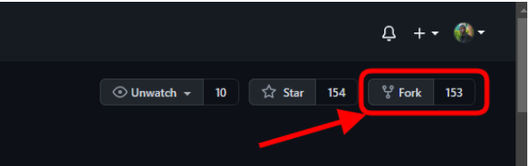
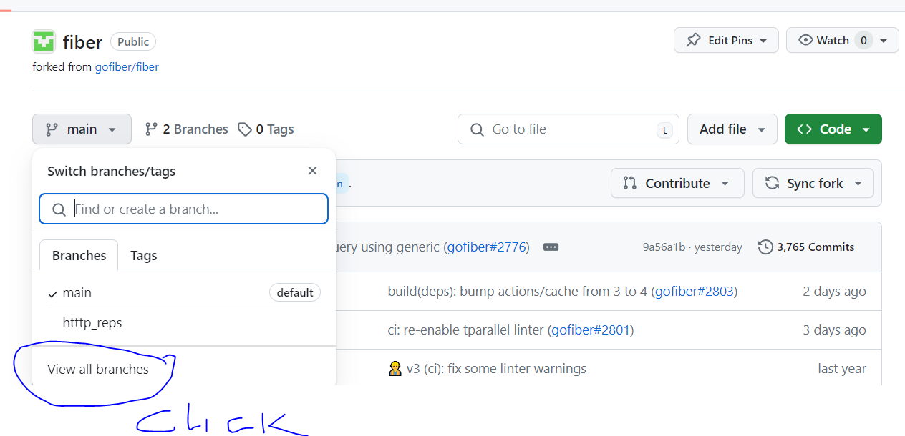
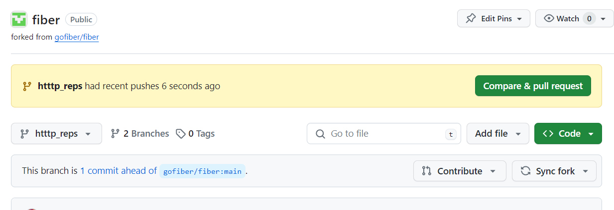

# Key Things to Know

1. fork repository


2. Clone to your local machine and make a branch to work on

```bash
git clone https://github.com/your-username/your-repository-name
git checkout -b your-new-branch-name

```

3. Make changes and commit them

```bash
git add .
git commit -m "your commit message"

```

4. test on your computer and push to github

```
# example for python
pytest
git push origin your-new-branch-name
```

5. Create Pull Request




6. Wait for Review and Merge Pull Request

## steps to contribute to open source projects

1. Find a Project: Start by finding a project that you are interested in contributing to. This could be a project related to a programming language you are familiar with, or a project that you use regularly. Websites like GitHub, GitLab, or SourceForge can be a good starting point.

2. Understand the Project: Once you've identified a project, take some time to understand it. Read the documentation, run the code, and understand what the project does and how it works.

3. Identify How You Can Contribute: Look for ways you can contribute. This could be by fixing bugs, adding new features, improving documentation, or even by providing translations. Most projects have a 'contributing' guide or a 'readme' file that outlines how you can get involved.

4. Set Up Your Environment: Set up your development environment to match the project's needs. This may involve installing specific software or libraries, setting up a development server, or configuring your text editor or IDE.

5. Make Your Contribution: Make your contribution by writing code, fixing bugs, improving documentation, or whatever else the project needs. Be sure to follow the project's coding standards and guidelines.

6. Test Your Changes: Before you submit your contribution, make sure to test your changes. Run the project's test suite, and manually test your changes to ensure they work as expected.

7. Submit a Pull Request: Once your changes are ready, submit a pull request. This is a proposal to the project maintainers to incorporate your changes into the project.

8. Respond to Feedback: The project maintainers may provide feedback on your pull request. Be sure to respond to this feedback, and make any necessary changes to your contribution.

9. Stay Involved: Even after your pull request has been accepted, stay involved with the project. Keep an eye on the project's issue tracker, help out with new issues, and continue to make contributions.

10. Respect the Community: Remember that open source projects are often maintained by volunteers who are donating their time and expertise. Be respectful, patient, and appreciative of their efforts.
